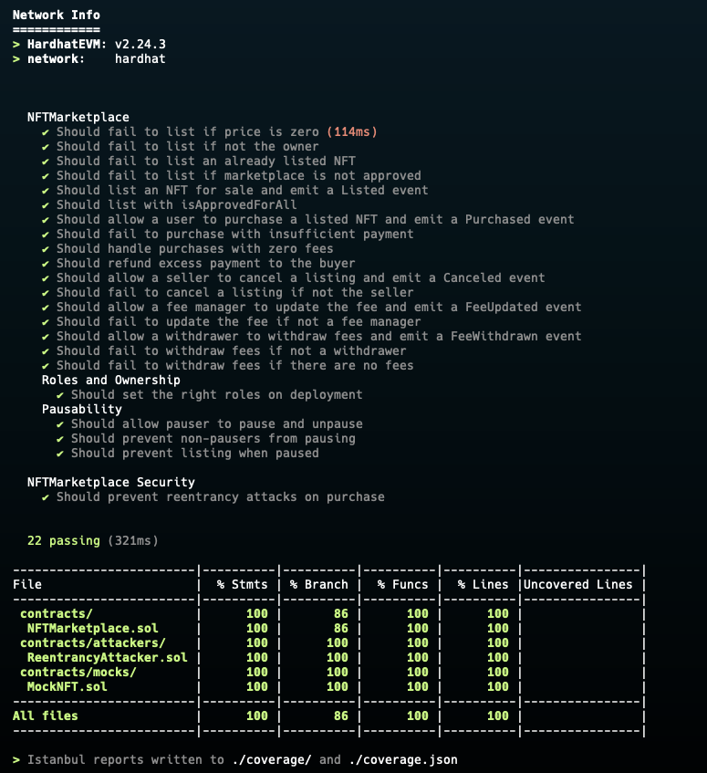
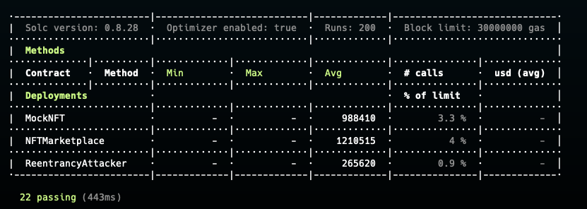
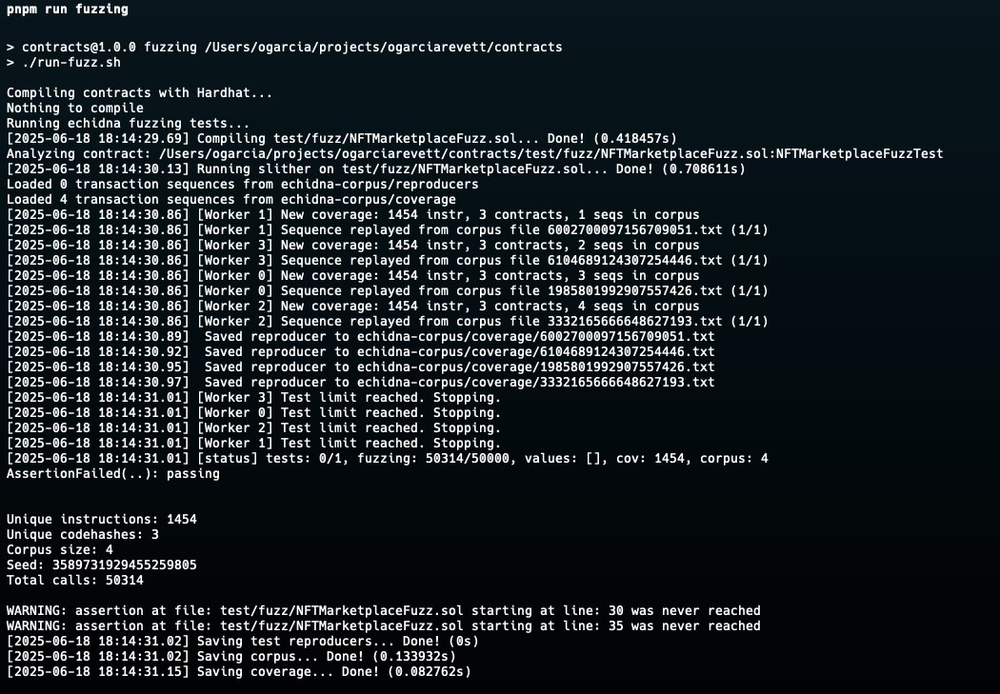

# EVM Smart Contracts

This repository contains a collection of custom smart contracts for the Ethereum Virtual Machine (EVM), primarily focused on security analysis and testing. It includes an NFT Marketplace and various attacker contracts.

## Project Structure

The project is organized with Hardhat, a development environment for Ethereum software. Key directories include:

- `/contracts`: Contains the Solidity source code for all smart contracts.
- `/ignition`: Holds the Hardhat Ignition modules for robust deployment.
- `/test`: Includes tests for the smart contracts.
- `/scripts`: (Not used in this project, but traditionally for deployment scripts).

## NFTMarketplace.sol

The `NFTMarketplace.sol` contract is a simple, fee-based marketplace for buying and selling ERC721 tokens.

### Core Features

- **List NFTs**: Sellers can list their ERC721 tokens for sale at a specific price. They must approve the marketplace contract to manage their NFT first.
- **Purchase NFTs**: Buyers can purchase a listed NFT by sending the required amount of native currency (e.g., SEI).
- **Cancel Listings**: Sellers can cancel their listings at any time, as long as the NFT has not been sold.
- **Marketplace Fees**: A percentage-based fee is taken from each sale and collected by the marketplace.
- **Role-Based Access Control**: The contract uses OpenZeppelin's `AccessControl` for managing permissions:
    - `DEFAULT_ADMIN_ROLE`: Can grant and revoke roles.
    - `FEE_MANAGER_ROLE`: Can update the sales fee percentage.
    - `PAUSER_ROLE`: Can pause and unpause the contract's core functions (`list`, `purchase`, `cancel`).
    - `WITHDRAWER_ROLE`: Can withdraw the accumulated marketplace fees.
- **Security**: Implements `ReentrancyGuard` to prevent re-entrancy attacks on the `purchase` function and is `Pausable` in case of emergencies.

## Available Scripts

This project uses `pnpm` as the package manager. The following scripts are defined in `package.json` to streamline development and deployment:

| Script                             | Description                                                                                        |
| ---------------------------------- | -------------------------------------------------------------------------------------------------- |
| `pnpm compile`                     | Compiles the smart contracts.                                                                      |
| `pnpm test`                        | Runs the test suite on the local Hardhat network and provides a gas usage report.                  |
| `pnpm test:ci`                     | Runs the test suite, optimized for Continuous Integration environments.                            |
| `pnpm lint`                        | Lints the TypeScript and JavaScript files in the project using ESLint and applies automatic fixes. |
| `pnpm solhint`                     | Lints the Solidity files using Solhint.                                                            |
| `pnpm format`                      | Formats the codebase using Prettier.                                                               |
| `pnpm format:check`                | Checks for formatting errors without applying changes.                                             |
| `pnpm coverage`                    | Generates a test coverage report for the smart contracts.                                          |
| `pnpm deploy:ignition:sei:testnet` | Deploys the `NFTMarketplace` contract to the Sei Testnet using Hardhat Ignition.                   |
| `pnpm deploy:ignition:sei:mainnet` | Deploys the `NFTMarketplace` contract to the Sei Mainnet using Hardhat Ignition.                   |

## Deployed Contracts (Sei Testnet)

The following contracts have been deployed to the Sei `atlantic-2` testnet.

- **MockNFT**: `0x35fd75dc81971D42AfB581Eb09Fe2699E4Be13E5`
    - [View on Seitrace](https://seitrace.com/address/0x35fd75dc81971D42AfB581Eb09Fe2699E4Be13E5?chain=atlantic-2)
- **NFTMarketplace**: `0xd785252C80DEe5B5D6c13b5047572342998E17d2`
    - [View on Seitrace](https://seitrace.com/address/0xd785252C80DEe5B5D6c13b5047572342998E17d2?chain=atlantic-2)

To interact with them, you can use the Seitrace block explorer links above, which provide a user interface for reading contract state and executing transactions.

## Test Coverage

The project maintains 100% test coverage across all smart contracts. The coverage report is generated by running `pnpm coverage`.



## Gas Usage

Gas usage reports are generated automatically when running the test suite with `pnpm test`. The following table shows the gas consumption for contract deployments.



## Security Audit

### Setup

First, you need to have the solidity compiler installed with the specific version of 0.8.28. You could use pip or brew or chocolate to install this dependencies locally.

1. `brew install solc-select`
2. `solc-select install 0.8.28`
3. `solc-select use 0.8.28`

Second, you need to install locally [slither](https://github.com/crytic/slither). There's a few ways to do it, but for simplicity I'll use brew.

`brew install slither`

## Fuzzing

This project uses [Echidna](https://github.com/crytic/echidna) for fuzz testing.

### Installation

To run fuzz tests locally, you need to install Echidna.

**MacOS:**

```bash
brew tap crytic/crytic
brew install echidna
```

**Linux:**

```bash
wget https://github.com/crytic/echidna/releases/download/v2.2.0/echidna-v2.2.0-ubuntu-20.04.tar.gz
tar -xzf echidna-v2.2.0-ubuntu-20.04.tar.gz
sudo mv echidna /usr/local/bin/
```

### Usage

To run the fuzz tests, execute the following command:

```bash
pnpm run fuzzing
```

Echidna will then analyze the contracts specified in `echidna.config.yml` and try to falsify the properties defined in the test files under `test/fuzz/`.


